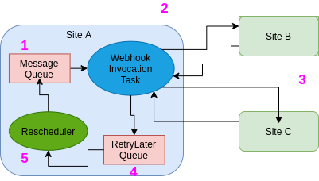

# Webhooks

* Retorno de chamada web ou HTTP. 
* Forma de recebimento de informações quendo um evento acontece.
* Forma de receber informações entre dois sistemas de uma forma passiva.

 

1. O que acontece se o site B estiver inacessível ou o tempo da requisição acabar?
2. O que acontece se a resposta vier com HTTP 5xx Error Code, ou seja, ter algum erro no site B?
* O site A deve salvar a mensagem e tentar enviar novamente depois.

## Uso de RabbitMQ para dar confiabilidade para webhook

* Utiliza-se uma fila de tarefas, para armazenar as mensagens, trazendo confiabilidade caso ocorra algum problema.
* Ack: para remover a mensagem da fila quando a resposta vier HTTP 200 Status Code.
* Nack: para manter a mensagem na fila e tentar a conexão novamente depois.

## Uso de RabbitMQ para tornar Webhook escalonável

1. Evento ocorre no Site S, mensagem vai para  fila de mensagens.
2. HTTP request.
3. Resposta com erro HTTP 5xx Error Code.
4. Mensagem com erro vai para a fila de "Retry Later". Ack remove a mensagem da fila de mensagens.
5. Reagendamento processa a mensagem da fila "Retry Later" e retorna a mensagem para a fila de mensagem.

[Exemplo de Webhook Scalable](Resumos/scalable.md)