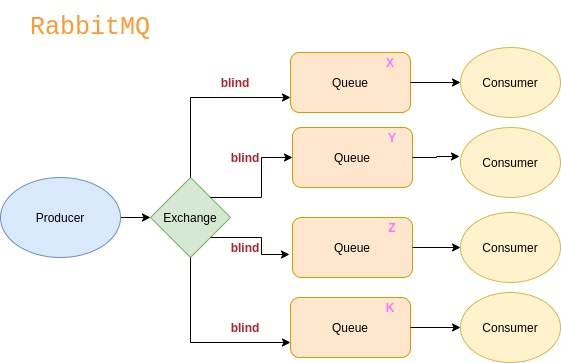

# RabbitMq
 
* **Message broker**: intermédio entre a mensagem recebida e quem a enviou.
* Utiliza HTTP request.

## Client -> TCP -> Server
O rabbitMQ abre apenas uma conexão com o server, e dentro dela há subconexões(**channels**).
* Channels são como threads.

## Publisher  ->  Exchange  ->  Queue  ->  Consumer
A **exchange** processa a mensagem e manda para uma determinada fila (queue).

### Exchanges

#### 1. Direct
* Há uma routing key que determina para qual fila a mensagem será enviada.

#### 2. Fanout
* Não há uma routing key, então a mensagem é replicada para todas as filas que estão relacionadas com a exchange. 
[Mais sobre Fanout](./Resumos/fanout.md)

#### 3. Topic
* Possui uma routing key com regras, com um padrão. Apenas mensagem com aquele padrão entram na determinada fila.

### [Queues](./Resumos/queue.md)
Filas são FIFO (First in First out).

#### Propriedades
* **Durable**: quando reiniciar o broker, a fila continua lá.
* **Auto Delete**: quando o consumer se desconecta, a fila é apagada.
* **Expiry**: Tempo de espera de inatividade.
* **Message TTL**: tempo de vida de mensagem.
* **Exclusive**: usada por apenas uma conexão e a fila será excluída quando a conexão for fechada.
* **Max length ou bytes**: quantidade máxima de mensagens ou de bytes.
* **Overflow**: limite de mensagens ou bytes.

[Mais sobre Queues](./Resumos/queue.md)
